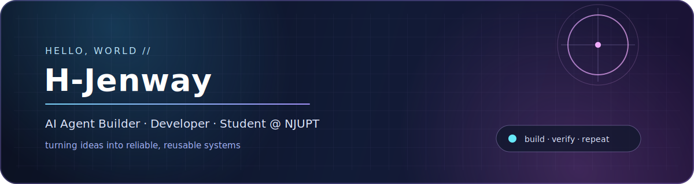
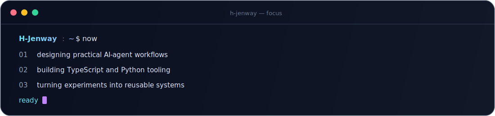
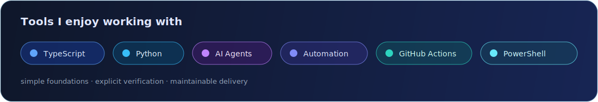
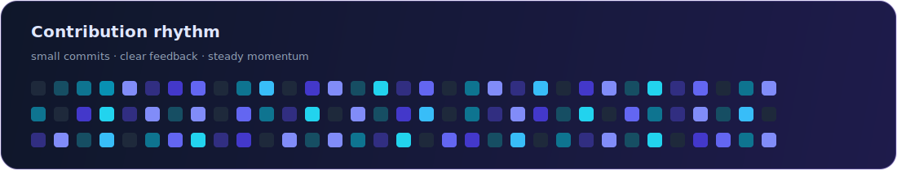

<h3>你好，我是 H-Jenway 👋</h3>

  专注于 AI Agent、自动化工具与工程化交付， 
  喜欢把复杂想法拆解成可验证、可维护、可持续迭代的系统。

AI Agent Builder · Developer · Student @ NJUPT

## 🙋 About Me

<table>
  <tr>
    <td width="50%" valign="top">
      <h3>我在做什么</h3>
      
围绕 AI Agent、开发者工具和自动化工作流进行实践，让创意更快成为能够真实运行的产品。

      
我重视清晰的结构、可靠的验证，以及能够长期维护的工程习惯。

    </td>
    <td width="50%" valign="top">
      <h3>What I care about</h3>
      <ul>
        <li>Human-in-the-loop 的智能体协作</li>
        <li>清晰、可靠的 TypeScript 与 Python 工程</li>
        <li>CLI、GitHub Actions 与自动化工作流</li>
        <li>从小型实验沉淀可复用工具</li>
      </ul>
    </td>
  </tr>
</table>

## 🧭 Current Focus

  

## 🧰 Tech Stack

  

## 🚀 Featured Work

| Project | Focus |
| --- | --- |
| `skills-repo` | Skills、开发工具与工程化工作流实践 |
| `protect-my-hair` | 个人主页、GitHub 实验与持续迭代记录 |

## 🌱 Build Rhythm

  

<strong>Build thoughtfully. Verify carefully. Keep shipping.</strong>

 

Made with Markdown and a little curiosity.

